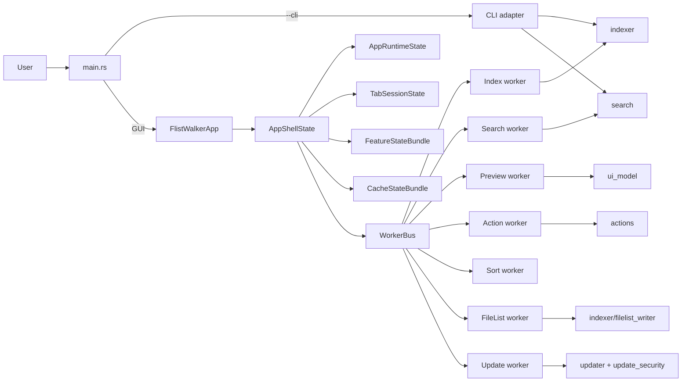
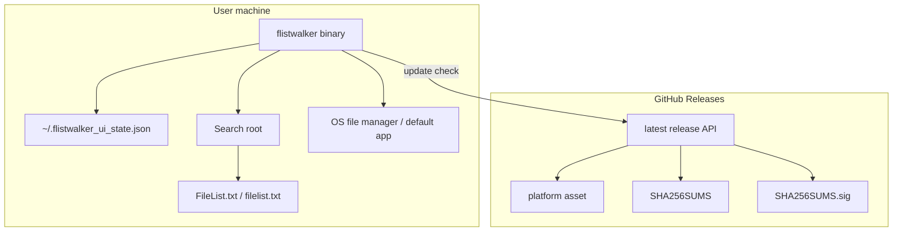
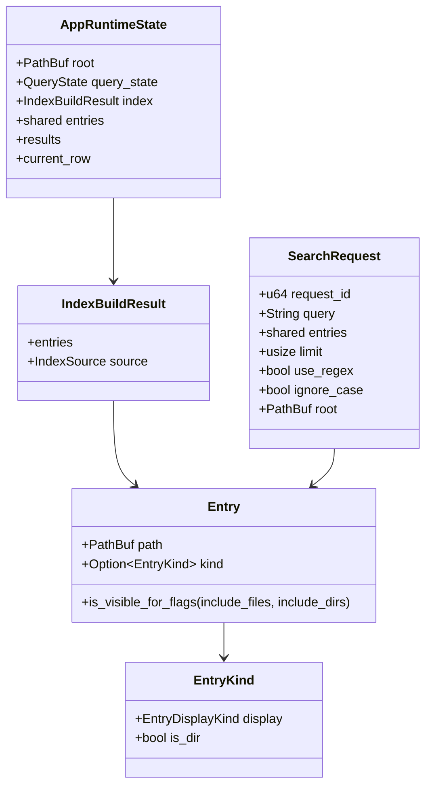
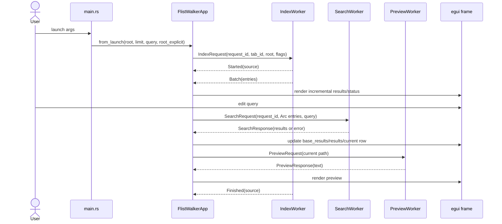
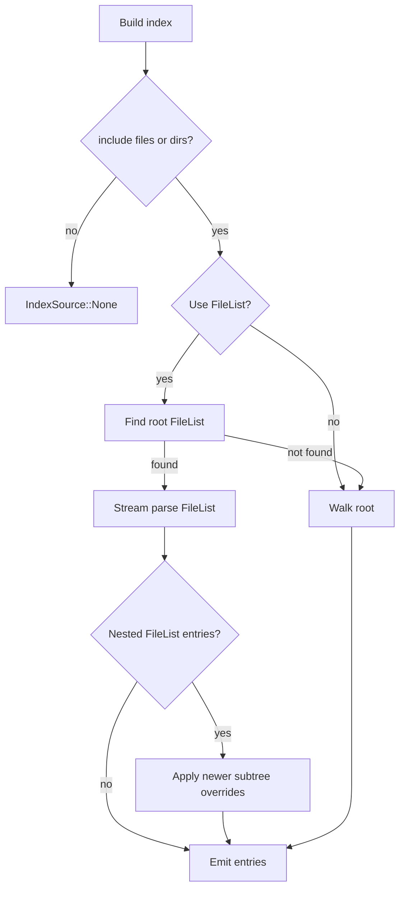
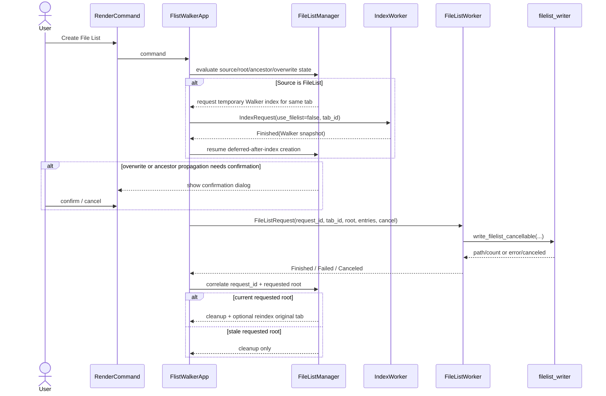
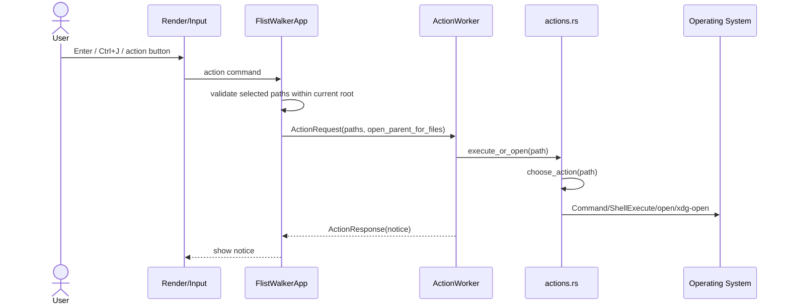
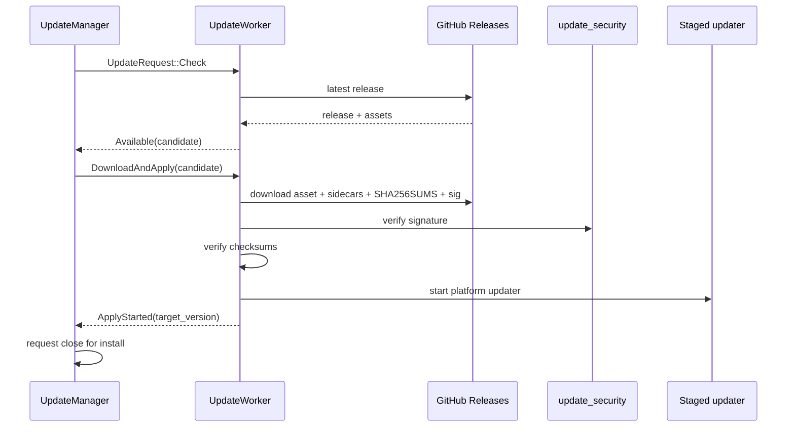

# FlistWalker Detailed Design

- [Overview](#1-overview)
- [Index](#2-index)
- [1. Overview](#1-overview)
- [2. Index](#2-index)
- [3. Audience and Reading Guide](#3-audience-and-reading-guide)
- [4. Scope](#4-scope)
- [5. Architecture Overview](#5-architecture-overview)
- [6. Module Detailed Design](#6-module-detailed-design)
- [7. Data Design](#7-data-design)
- [8. Control Flow and Sequence](#8-control-flow-and-sequence)
- [9. Error Handling and Resilience](#9-error-handling-and-resilience)
- [10. Security and Operations](#10-security-and-operations)
- [11. Test Strategy](#11-test-strategy)
- [12. Trade-offs and Extension Points](#12-trade-offs-and-extension-points)
- [13. Open Questions](#13-open-questions)
- [14. Traceability Summary](#14-traceability-summary)

## 1. Overview

This document is the repository-level detailed design for FlistWalker as of 2026-04-21. It complements the normative SDD documents:

- [REQUIREMENTS.md](./REQUIREMENTS.md)
- [SPEC.md](./SPEC.md)
- [DESIGN.md](./DESIGN.md)
- [ARCHITECTURE.md](./ARCHITECTURE.md)
- [TESTPLAN.md](./TESTPLAN.md)

Fact: FlistWalker is a Rust GUI/CLI tool that builds a file/folder candidate set from either `FileList.txt`/`filelist.txt` or a recursive walker, searches it with fzf-like operators, and opens or executes selected paths. The primary implementation lives under [rust/src](../rust/src), with CLI/GUI entry selection in [main.rs](../rust/src/main.rs) and shared library modules exported from [lib.rs](../rust/src/lib.rs).

Rationale: the codebase keeps expensive I/O and search work outside the egui frame loop. GUI state is coordinated by `FlistWalkerApp`, but indexing, search, preview, sorting, actions, FileList writing, kind resolution, and update work are delegated to dedicated workers and owner modules.

Process note: this document was created and revised through the repository plan gate. The latest thickness review explicitly checked the existing SDD contracts and closed the in-scope gaps called out for FileList creation, Window/IME stability, CI/release hygiene, diagnostics, validation, and traceability.

[[↑ Back to Top]](#top)

## 2. Index

### Core Implementation Map

| Area | Primary files | Responsibility |
| --- | --- | --- |
| Entrypoint | [main.rs](../rust/src/main.rs), [lib.rs](../rust/src/lib.rs) | Parse CLI args, select CLI/GUI mode, configure tracing/window/icon, expose library modules. |
| Candidate model | [entry.rs](../rust/src/entry.rs) | Canonical `Entry`, `EntryKind`, and file/dir/link display kind. |
| Indexing | [indexer/mod.rs](../rust/src/indexer/mod.rs), [indexer/filelist_reader.rs](../rust/src/indexer/filelist_reader.rs), [indexer/walker.rs](../rust/src/indexer/walker.rs), [indexer/filelist_writer.rs](../rust/src/indexer/filelist_writer.rs), [app/index_worker.rs](../rust/src/app/index_worker.rs) | FileList detection/streaming, nested FileList override, walker collection, FileList generation/ancestor propagation, GUI streaming batches. |
| Search | [query.rs](../rust/src/query.rs), [search/mod.rs](../rust/src/search/mod.rs), [search/cache.rs](../rust/src/search/cache.rs), [search/execute.rs](../rust/src/search/execute.rs), [search/rank.rs](../rust/src/search/rank.rs) | fzf-like query parsing, regex/plain token routing, ranking, prefix cache, sequential/parallel execution. |
| Ignore list | [ignore_list.rs](../rust/src/ignore_list.rs), [query.rs](../rust/src/query.rs), [app/bootstrap.rs](../rust/src/app/bootstrap.rs), [app/session.rs](../rust/src/app/session.rs), [app/ui_state.rs](../rust/src/app/ui_state.rs), [app/shell_support.rs](../rust/src/app/shell_support.rs), [app/render.rs](../rust/src/app/render.rs), [app/render_panels.rs](../rust/src/app/render_panels.rs), [main.rs](../rust/src/main.rs) | exe-relative ignore file loading, persisted toggle state, and candidate exclusion. |
| GUI shell | [app/mod.rs](../rust/src/app/mod.rs), [app/state.rs](../rust/src/app/state.rs), [app/bootstrap.rs](../rust/src/app/bootstrap.rs), [app/session.rs](../rust/src/app/session.rs) | eframe app, shell bundles, startup/restore/persist/shutdown orchestration. |
| GUI flow owners | [app/pipeline.rs](../rust/src/app/pipeline.rs), [app/pipeline_owner.rs](../rust/src/app/pipeline_owner.rs), [app/tabs.rs](../rust/src/app/tabs.rs), [app/response_flow.rs](../rust/src/app/response_flow.rs), [app/result_reducer.rs](../rust/src/app/result_reducer.rs) | Index/search polling, active/background tab routing, result state transitions. |
| Rendering/input | [app/render.rs](../rust/src/app/render.rs), [app/render_panels.rs](../rust/src/app/render_panels.rs), [app/render_tabs.rs](../rust/src/app/render_tabs.rs), [app/input.rs](../rust/src/app/input.rs), [app/query_state.rs](../rust/src/app/query_state.rs) | UI panels, commands from UI events, shortcuts, query/history editing. |
| Shell/support helpers | [app/coordinator.rs](../rust/src/app/coordinator.rs), [app/root_browser.rs](../rust/src/app/root_browser.rs), [app/shell_support.rs](../rust/src/app/shell_support.rs), [app/worker_support.rs](../rust/src/app/worker_support.rs) | Status/notice helpers, root browser lifecycle, process/window/IME support, shared worker routing helpers. |
| Workers | [app/worker_protocol.rs](../rust/src/app/worker_protocol.rs), [app/worker_bus.rs](../rust/src/app/worker_bus.rs), [app/worker_tasks.rs](../rust/src/app/worker_tasks.rs), [app/workers.rs](../rust/src/app/workers.rs), [app/worker_runtime.rs](../rust/src/app/worker_runtime.rs) | Request/response contracts, channel bundle, worker bodies, spawn registry, shutdown joins. |
| OS integration | [actions.rs](../rust/src/actions.rs), [path_utils.rs](../rust/src/path_utils.rs), [fs_atomic.rs](../rust/src/fs_atomic.rs) | Open/execute behavior, path normalization, atomic file writes. |
| Self-update | [updater.rs](../rust/src/updater.rs), [update_security.rs](../rust/src/update_security.rs), [app/update.rs](../rust/src/app/update.rs) | GitHub release candidate selection, signature/checksum verification, update UI flow. |

### Terms

| Term | Meaning |
| --- | --- |
| Candidate | A filesystem path exposed as a searchable `Entry`. |
| FileList source | A candidate source loaded from `FileList.txt` / `filelist.txt`. |
| Walker source | A candidate source collected by recursive filesystem traversal. |
| Active tab | The tab currently projected into `AppRuntimeState`. |
| Background tab | A tab held as `AppTabState`, with responses routed without mutating the active tab state. |
| request_id | Monotonic request identifier used to reject stale worker responses. |
| epoch | Kind resolver generation identifier used to prevent old metadata updates from corrupting current cache state. |

[[↑ Back to Top]](#top)

## 3. Audience and Reading Guide

For AI agents: read sections 5 through 9 before editing code. They define owner boundaries, state bundles, worker protocol contracts, and stale-response rules. Use [TESTPLAN.md](./TESTPLAN.md) validation matrix after choosing files to edit.

For existing developers: section 6 is the module ownership map. Section 12 records trade-offs that should not be accidentally reversed, especially FileList fast path, request routing, and action security.

For new contributors: read sections 1, 5, and 8 first. Then inspect the files linked from the relevant feature row in section 6.

[[↑ Back to Top]](#top)

## 4. Scope

### In Scope

- Rust GUI/CLI architecture.
- FileList and walker indexing.
- Query parsing, search, ranking, highlighting, and result sorting.
- egui app state ownership, worker model, tab routing, preview, action, FileList creation, and self-update flows.
- Error handling, security boundaries, release/runtime operations, and tests.

### Out of Scope

- Python prototype implementation under [prototype/python](../prototype/python), except as historical context.
- Installer creation and macOS auto-update, both marked out of scope by [REQUIREMENTS.md](./REQUIREMENTS.md).
- Network-drive-specific optimization.
- Any new behavior not already described by existing SDD docs or code.

[[↑ Back to Top]](#top)

## 5. Architecture Overview

FlistWalker is a single-process desktop/CLI application. The GUI path creates an eframe app and a set of background worker threads. The CLI path uses the same index and search modules synchronously.

The central design rule is that `FlistWalkerApp` remains an orchestration shell. State mutations should flow through owner modules and reducers rather than direct ad hoc field updates inside rendering code.

### Deployment View

There is no server-side component. GitHub Releases is only used for update discovery and asset download.

[[↑ Back to Top]](#top)

## 6. Module Detailed Design

### 6.1 Entrypoint and CLI Adapter

Responsibility: [main.rs](../rust/src/main.rs) owns `Args`, tracing setup, signal handler registration, root canonicalization, CLI execution, GUI startup, Windows DPI setup, and app icon loading.

Public interface:

- `flistwalker [query] [--root PATH] [--limit N] [--cli]`
- `run_cli(args)` builds an index and prints candidates or scored results.
- `run_gui(args)` creates `eframe::NativeOptions` and launches `FlistWalkerApp::from_launch`.

Inputs and outputs:

- Input: CLI args, process environment, filesystem root.
- Output: stdout/stderr in CLI mode, eframe native window in GUI mode.

Failure modes:

- Root canonicalization failure or non-directory root returns an `anyhow` error.
- GUI startup maps eframe errors into `anyhow`.
- CLI action does not execute selected results; it prints index/search output only.

### 6.2 Candidate and Entry Model

Responsibility: [entry.rs](../rust/src/entry.rs) defines `Entry { path, kind }`, `EntryKind`, and `EntryDisplayKind`.

Important constraints:

- `Entry.kind` is optional because FileList and walker fast paths may initially avoid metadata calls.
- `Entry::is_visible_for_flags(include_files, include_dirs)` treats unknown kind as visible only when both files and dirs are enabled.
- `EntryKind::link(is_dir)` records both display type and directory behavior.

Rationale: separating path identity from kind resolution allows large FileList/walker streams to reach the UI quickly while slower metadata refinement happens later.

### 6.3 Indexing Domain

Responsibility: [indexer/mod.rs](../rust/src/indexer/mod.rs) exposes synchronous index APIs and coordinates FileList-vs-walker selection.

Public interfaces:

- `build_index_with_metadata(root, use_filelist, include_files, include_dirs) -> IndexBuildResult`
- `build_index(...) -> Vec<PathBuf>`
- Re-exported FileList functions such as `find_filelist`, `parse_filelist_stream`, and `write_filelist_cancellable`.

Internal logic:

- If both include flags are false, return `IndexSource::None`.
- If FileList mode is enabled and a first-level FileList exists, parse FileList hierarchy.
- Otherwise fall back to walker.
- Nested FileList override only considers FileList entries already present in the loaded candidate set.

Failure modes:

- FileList read/parse errors propagate as `anyhow::Result`.
- Nested FileList supersede is represented as an error string in GUI worker paths and as an error in synchronous paths.

### 6.4 GUI Index Worker

Responsibility: [app/index_worker.rs](../rust/src/app/index_worker.rs) adapts indexing to the GUI streaming model.

Important behaviors:

- Sends `IndexResponse::Started` before streaming candidates.
- Emits `Batch` responses to keep the UI incremental.
- Emits `ReplaceAll` when nested FileList overrides require replacing a subtree.
- Uses `latest_request_ids` by tab to cancel superseded index work.
- Uses walker `file_type` for fast file/dir classification and defers symlink/shortcut metadata when possible.
- Caps walker results with `WALKER_MAX_ENTRIES_DEFAULT` and reports `Truncated`.

Rationale: GUI indexing is latency-sensitive. Streaming batches and request supersede prevent stale or long-running indexing from blocking user interaction.

### 6.5 Search Domain

Responsibility: [query.rs](../rust/src/query.rs) parses user query syntax, while [search/mod.rs](../rust/src/search/mod.rs) compiles and evaluates it.

Public APIs include:

- `search_entries_with_scope(query, entries, limit, use_regex, ignore_case, root, prefer_relative)`
- `rank_search_results(entries, query, root, limit, use_regex, ignore_case, prefer_relative, prefix_cache)`

Design facts:

- Plain include tokens remain fuzzy/literal matchers even when regex mode is enabled.
- Regex compilation happens once per query for tokens that use regex syntax.
- Exact, exclude, anchored, OR alternative, literal bonus, and exact bonus terms are compiled into `CompiledQuery`.
- The execution path chooses sequential or parallel collection based on candidate count and environment-tuned thresholds.
- Prefix cache is used when a new query extends the previous query over the same snapshot.
- Ignore list filtering is a separate global candidate filter sourced from the executable directory; it uses the same `!`-style exclusion comparison as query exclude tokens, but is toggled via a persisted GUI checkbox before search dispatch and empty-query result rendering.

Failure modes:

- Invalid regex returns an error string to the GUI search response.
- Empty query and `limit == 0` are handled as non-error boundary cases.

### 6.6 GUI Shell and State Bundles

Responsibility: [app/mod.rs](../rust/src/app/mod.rs) defines `FlistWalkerApp { shell: AppShellState }`. [app/state.rs](../rust/src/app/state.rs) defines the major bundles.

The shell owns:

- `AppRuntimeState`: active root, query, filters, index snapshot, active results, selection, preview, notice, status.
- `SearchCoordinator`: active/background search request lifecycle.
- `IndexCoordinator`: index request lifecycle, inflight tracking, incremental state.
- `WorkerBus`: channels for non-index workers.
- `RuntimeUiState`: focus, scrolling, preview panel, drag state, UI flags.
- `CacheStateBundle`: preview, highlight, entry kind, and sort metadata caches.
- `TabSessionState`: persisted/background tabs and request-tab routing maps.
- `FeatureStateBundle`: root browser, FileList manager, update manager.
- `WorkerRuntime`: shutdown signal and join handles.

Rationale: the shell makes ownership explicit. Active-tab live state is separate from persisted/background tab snapshots, which prevents background worker responses from overwriting the visible tab.

### 6.7 Tab and Session Design

Responsibility: [app/tab_state.rs](../rust/src/app/tab_state.rs), [app/tabs.rs](../rust/src/app/tabs.rs), and [app/session.rs](../rust/src/app/session.rs) own tab snapshots, tab lifecycle, and persisted UI state.

Persisted state includes:

- Last/default root.
- Preview visibility and panel sizes.
- Shared query history.
- Saved tabs and active tab index.
- Window geometry.
- Update skip/failure dialog preferences.

Rules:

- `FLISTWALKER_RESTORE_TABS=1` gates tab restore.
- `FLISTWALKER_DISABLE_HISTORY_PERSIST=1` disables query history load/save.
- Restored background tabs are refreshed lazily.
- Request routing maps bind preview/action/sort request IDs to tab IDs and are cleared when tabs close.
- Tab drag/reorder preserves active tab identity by tab ID, not by stale vector index.
- Tab accent is part of saved tab state and is rendered differently for active full-fill and inactive accent decoration.
- Background tabs may compact display caches, but retain enough base result/index state to restore without unnecessary reindexing.
- Closing a tab clears request routing for preview/action/sort so late worker responses cannot target a removed tab.

### 6.8 Rendering and Input

Responsibility: rendering modules collect UI intent and produce commands; owner modules apply state transitions.

Key design:

- [app/render.rs](../rust/src/app/render.rs) and split render modules draw panels, dialogs, tabs, and result lists.
- `RenderCommand` boundaries prevent immediate complex state mutation from inside UI painting code.
- [app/input.rs](../rust/src/app/input.rs), [app/input_history.rs](../rust/src/app/input_history.rs), and [app/query_state.rs](../rust/src/app/query_state.rs) handle shortcuts, IME fallback, query editing, and shared history.

Rationale: egui UI code is easier to regress when it directly mutates cross-feature state. Command dispatch after drawing keeps rendering and behavior boundaries clearer.

### 6.9 Shell Support, Root Browser, and Window/IME Stability

Responsibility: [app/shell_support.rs](../rust/src/app/shell_support.rs) owns process shutdown, egui font setup, window trace helpers, and shell-local support policy. [app/root_browser.rs](../rust/src/app/root_browser.rs) owns root selector state and root change cleanup. [app/coordinator.rs](../rust/src/app/coordinator.rs) owns status/notice helpers and root/path comparison helpers. [app/worker_support.rs](../rust/src/app/worker_support.rs) keeps reusable worker routing and action target helpers out of worker spawn code.

Window and input stability rules:

- Windows configures System DPI awareness before native window creation to reduce monitor-crossing resize jitter.
- Saved window geometry is clamped against monitor dimensions before persistence and again during startup restore when monitor data exists.
- `FLISTWALKER_WINDOW_TRACE=1` is the opt-in GUI/session/input/update diagnostic channel and stays separate from worker-side `tracing`.
- IME fallback handles `CompositionEnd` text and space insertion gaps without forcing insertion at the query end; fallback text is inserted at the current cursor position.
- Root changes clear old-root current row, pinned paths, preview, pending FileList confirmations, pending use-walker confirmation, and deferred-after-index state.
- Root containment checks are kept out of FileList/walker indexing and are enforced at action dispatch.

Rationale: these helpers are intentionally not embedded in rendering or worker bodies. Keeping them as shell support boundaries prevents the app coordinator from regrowing broad platform and diagnostics responsibilities.

### 6.10 Worker Protocol and Runtime

Responsibility: [app/worker_protocol.rs](../rust/src/app/worker_protocol.rs) centralizes request/response structs. [app/worker_bus.rs](../rust/src/app/worker_bus.rs) groups channels. [app/worker_tasks.rs](../rust/src/app/worker_tasks.rs) implements worker bodies.

Worker families:

- Search: latest queued request wins; uses `SearchPrefixCache`.
- Preview: latest queued request wins; builds preview text.
- Kind resolver: resolves delayed `EntryKind` and updates cache by epoch.
- FileList writer: writes `FileList.txt`, supports cancellation.
- Action: opens/executes selected paths.
- Sort metadata: resolves modified/created timestamps for current results.
- Update: checks/releases and stages update.

Failure mode handling:

- Most workers return response variants containing `error` or `notice` text.
- Receiver closure is traced and terminates the worker loop.
- Shutdown uses a shared atomic flag plus bounded join in [app/worker_runtime.rs](../rust/src/app/worker_runtime.rs).

### 6.11 FileList Creation Lifecycle

Responsibility: [app/filelist.rs](../rust/src/app/filelist.rs), `FileListManager` in [app/state.rs](../rust/src/app/state.rs), [app/worker_protocol.rs](../rust/src/app/worker_protocol.rs), [app/worker_tasks.rs](../rust/src/app/worker_tasks.rs), and [indexer/filelist_writer.rs](../rust/src/indexer/filelist_writer.rs) own the Create File List workflow.

Lifecycle rules:

- The app separates overwrite confirmation, ancestor propagation confirmation, use-walker confirmation, deferred-after-index, in-flight request, and cancel state in `FileListWorkflowState`.
- FileList source tabs do not create a new tab for Create File List. They temporarily run Walker indexing for the same tab, create the FileList from that Walker snapshot, then restore normal FileList indexing for that tab.
- The worker request carries `request_id`, `tab_id`, requested `root`, candidate entries, propagation choice, and a shared cancel flag.
- Responses are correlated by `request_id` and requested root. A stale requested-root completion performs cleanup only and does not restore `use_filelist`, reindex the wrong tab, or update the visible notice as if it were current.
- Cancellation sets the cancel flag and expects a `Canceled` response; final root replacement and ancestor propagation must not start if cancellation has already been observed at the boundary.
- FileList writing uses an atomic/temporary write path where possible. Cross-device final placement falls back to copy so only the final destination is replaced.
- Ancestor propagation appends a child FileList reference without duplicates, restores the parent FileList mtime after append, and treats ancestor update failures as non-fatal to the root FileList creation result.
- Root changes destroy old-root pending confirmations and deferred FileList state to prevent accidental overwrite or propagation against a previous root.

Rationale: Create File List crosses UI confirmation, indexing, file writing, and tab routing. Keeping it in a manager and command boundary avoids direct `FlistWalkerApp` mutation and makes stale/cancel behavior testable.

### 6.12 Actions and OS Integration

Responsibility: [actions.rs](../rust/src/actions.rs) chooses `Open` or `Execute` and calls platform-specific mechanisms.

Important rules:

- Direct execution avoids shell expansion by using `Command::new(path)`.
- Windows open uses `ShellExecuteW` with wide strings and normalized shell path.
- macOS uses `open`; Linux/Unix uses `xdg-open`.
- Windows `.ps1` is treated as open, not execute.
- GUI root containment checks happen immediately before action dispatch, not during indexing.

### 6.13 Self-update

Responsibility: [updater.rs](../rust/src/updater.rs), [update_security.rs](../rust/src/update_security.rs), [app/update.rs](../rust/src/app/update.rs), and update worker code handle update discovery and application.

Flow:

- Fetch GitHub latest release metadata.
- Compare semver target with current version.
- Select platform asset, README, LICENSE, THIRD_PARTY_NOTICES, `SHA256SUMS`, and `SHA256SUMS.sig`.
- Verify detached signature before trusting checksums.
- Verify staged asset checksum.
- Windows/Linux can auto-apply; macOS remains manual-only.

Operational guardrails:

- `FLISTWALKER_DISABLE_SELF_UPDATE` env var or sentinel file disables self-update.
- Builds without embedded update public key degrade to manual-only.
- Startup update failures are shown without blocking normal GUI work.

[[↑ Back to Top]](#top)

## 7. Data Design

### 7.1 Core Entities

### 7.2 State Lifecycle

| State | Owner | Lifecycle |
| --- | --- | --- |
| `Entry` | indexer/index worker | Created by FileList/walker; kind may be unknown initially and refined later. |
| `IndexBuildResult` | indexer / app runtime | Replaced on root/filter/source changes; source recorded as FileList/Walker/None. |
| `base_results` | result reducer | Holds search score order for returning to `Score`. |
| `results` | result reducer/render | Current display order after optional sort. |
| `AppTabState` | tab owner | Snapshot for background/persisted tabs. |
| `UiState` | session owner | JSON persisted in user home. |
| `UpdateCandidate` | updater/update manager | Created from release metadata; consumed by update prompt/install request. |
| `FileListWorkflowState` | FileList manager | Tracks confirmations, in-flight request, cancel flag, requested root, and deferred-after-index state. |
| `UpdateState` | Update manager | Tracks startup check/download request ID, prompt/failure/install-started state, skip target, and failure suppression. |
| `CacheStateBundle` | app shell | Holds bounded preview/highlight/entry-kind/sort caches and is invalidated on root/index-scope changes. |
| `RequestTabRoutingState` | tab session | Maps preview/action/sort request IDs to tab IDs until the response is consumed or the tab closes. |

### 7.3 Integrity Constraints

- `request_id` responses must only update the matching active request or mapped background tab.
- `Entry.kind == None` must not trigger synchronous metadata probing in render hot paths.
- `base_results` must remain the score-order source while `results` may be sorted.
- Query history is shared across tabs but persistence can be disabled.
- FileList creation state is correlated by both request ID and requested root.
- Update assets are trusted only after signature and checksum validation.
- Sort metadata responses are accepted only for the current sort request and mode.
- Entry kind updates use cache/epoch style side channels instead of mutating large shared entry vectors in hot paths.
- Update prompt/failure/install-started transitions must not be overwritten by stale update responses.

### 7.4 State Transition Summary

| Flow | Main states | Accepted transition | Stale/cancel handling |
| --- | --- | --- | --- |
| Indexing | `Started`, `Batch`, `ReplaceAll`, `Finished`, `Failed`, `Canceled`, `Truncated` | Matching request updates active runtime or routed background tab. | Superseded request is canceled or ignored; old batches cannot rewind the active tab. |
| Search | `SearchRequest` -> `SearchResponse` | Latest active request updates `base_results`, `results`, `current_row`, and notice/error. | Older request IDs are discarded; query edits reset sort state to `Score`. |
| FileList creation | pending confirmation -> in-flight -> finished/failed/canceled | Matching request/root may restore FileList mode and reindex the originating tab. | Stale requested root performs cleanup only; cancel releases pending/in-progress state without success follow-up. |
| Sort metadata | request -> metadata response | Matching request/mode updates sort metadata cache and display order. | Stale response is ignored and route entry is removed. |
| Preview | request -> preview response | Matching active/routed tab updates preview if path still applies. | Late responses for closed/background-mismatched tabs are discarded. |
| Update | check/download request -> prompt/failure/apply-started | Matching request updates update manager state and optional close-for-install flag. | Stale response cannot replace a newer prompt/failure/install-started state. |
| Tab session | capture/apply/switch/reorder/close | Active live state is snapshotted before tab identity changes. | Closing a tab clears request routing and pending restore refresh for that tab. |

[[↑ Back to Top]](#top)

## 8. Control Flow and Sequence

### 8.1 GUI Startup, Index, Search, Preview

Key guarantees:

- Index batches can arrive while the user continues typing.
- Search request IDs prevent old responses from replacing newer query results.
- Preview runs asynchronously and can lag behind row movement without blocking it.

### 8.2 FileList Priority and Fallback

The root FileList detection is intentionally limited to the root directory. Hierarchical expansion is driven by candidate entries, not arbitrary recursive discovery.

### 8.3 Create File List

The manager boundary exists because this flow combines UI confirmations, temporary indexing, file writes, ancestor propagation, cancellation, and tab routing. The worker owns filesystem work; the app/manager owns state cleanup and follow-up dispatch.

### 8.4 Action Execution

Root containment is checked immediately before dispatch. This preserves FileList indexing speed while preventing root-external execution.

### 8.5 Self-update

If update support is manual-only, the GUI can present the release URL without launching replacement logic.

[[↑ Back to Top]](#top)

## 9. Error Handling and Resilience

### Error Classes

| Class | Handling |
| --- | --- |
| Invalid root | `resolve_root` returns an error before CLI/GUI flow continues. |
| FileList read/parse failure | Synchronous CLI returns error; GUI worker returns `Failed`. |
| Superseded index/search | Newer request ID cancels or causes stale response discard. |
| Invalid regex | Search worker returns error text; GUI keeps normal operation. |
| Preview decode/unreadable file | Preview text reports unavailable/unreadable state rather than blocking UI. |
| Action failure | Worker returns a notice/error string; GUI displays it. |
| Update check/download/verification failure | Update manager records failure dialog/notice; search UI remains usable. |
| Worker shutdown delay | Runtime uses shutdown flag and bounded join timeout. |
| Root change during pending FileList flow | Pending confirmations, deferred-after-index state, preview, pinned paths, and current row are cleared for the old root. |
| Stale sort/update response | Request ID and mode/state checks prevent old metadata or update results from overwriting current UI state. |
| Ancestor FileList propagation failure | Ancestor update is silently stopped; root FileList creation remains successful when the root write completed. |

### Resilience Patterns

- Latest request wins: search and preview workers drain queued requests and process only the newest.
- Stale response rejection: active request IDs and tab routing maps gate response application.
- Incremental indexing: FileList and walker produce batches rather than one large final vector.
- Deferred metadata: unknown file kind and date metadata are resolved outside initial index/render hot paths.
- Bounded caches: preview/highlight/sort metadata caches avoid unbounded long-session growth.
- Graceful degradation: self-update becomes manual-only when platform/key support is insufficient.
- Root cleanup: root switches explicitly discard old-root selection and confirmation state before new indexing begins.
- Trace separation: worker-side structured tracing and GUI window trace remain separate so diagnostics cannot alter request routing behavior.

[[↑ Back to Top]](#top)

## 10. Security and Operations

### Security Design

- External commands are invoked through argument arrays or platform APIs, not shell string expansion.
- Windows `.ps1` search results are opened rather than directly executed.
- FileList may display root-external entries, but GUI action execution validates current-root containment before launching.
- Self-update verifies `SHA256SUMS.sig` before trusting `SHA256SUMS`, then verifies staged file checksums.
- Update override environment variables are development/manual-test only and must not be documented in public user help.
- Query history is stored locally in plain text and can be disabled with `FLISTWALKER_DISABLE_HISTORY_PERSIST=1`.

### Operations

| Operation | Design |
| --- | --- |
| Build | `cargo` from [rust](../rust), with Windows GNU helper scripts under [scripts](../scripts). |
| GUI run | `cargo run -- --root .. --limit 1000`. |
| CLI run | `cargo run -- --cli "query" --root .. --limit 1000`. |
| Release | Release assets and sidecar notices are managed by scripts and GitHub Actions described in [RELEASE.md](./RELEASE.md). |
| Diagnostics | Worker tracing uses `RUST_LOG`; GUI/window trace uses `FLISTWALKER_WINDOW_TRACE=1` and optional path override. |
| Support | [SUPPORT.md](./SUPPORT.md) defines redaction and issue reporting expectations. |
| CI security | Cross-platform CI keeps release OS targets under test and runs dependency vulnerability checks such as `cargo audit`. |
| Coverage | The CI coverage gate uses `cargo llvm-cov` with the line threshold documented in [TESTPLAN.md](./TESTPLAN.md). |
| Windows GNU release | WSL/Linux build scripts keep `x86_64-pc-windows-gnu` builds and Windows resource/icon embedding reproducible. |
| Release sidecars | Standalone assets and archives must carry README, LICENSE, and THIRD_PARTY_NOTICES sidecars. |
| macOS notarization | Notarization is currently a documented manual/non-blocking release consideration until signing infrastructure is ready. |

### Diagnostics and Supportability

Worker-side tracing is opt-in through `RUST_LOG` and uses canonical fields for request flows:

- `flow`: logical worker family such as `search`, `preview`, `filelist`, `action`, `sort`, `update`, or `index`.
- `event`: event family such as `started`, `finished`, `failed`, `canceled`, `receiver_closed`, `completed`, or `superseded`.
- `request_id`: present for request-scoped flows.
- `source_kind`: used by index flow to distinguish `filelist`, `walker`, and `none`.

GUI/session/input/update diagnostics use `FLISTWALKER_WINDOW_TRACE=1` and optional `FLISTWALKER_WINDOW_TRACE_PATH`. This channel is for window geometry, IME composition, query text changes, startup/update dialog state, and similar UI diagnostics. It is intentionally separate from worker `tracing` so support instrumentation does not change hot-path request acceptance.

Support documents and issue templates should ask for version, OS, launch mode, reproduction steps, and redacted diagnostics, while avoiding claims of default telemetry or automatic crash upload.

### Failure Triage

1. For search/index issues, inspect source kind, request ID, root, include flags, and whether the response was stale.
2. For GUI state mix-ups, inspect active tab ID, background routing maps, and `AppTabState` snapshot boundaries.
3. For FileList creation, inspect request ID, requested root, pending confirmation state, and cancel flag.
4. For update issues, inspect candidate asset names, support classification, signature/checksum result, and platform path.
5. For Window/IME issues, inspect saved/restored geometry, monitor clamp data, DPI setup, `CompositionEnd` fallback, and window trace events.
6. For release issues, inspect asset names, sidecar completeness, checksum/signature files, release template notes, and notarization status.

[[↑ Back to Top]](#top)

## 11. Test Strategy

Testing follows [TESTPLAN.md](./TESTPLAN.md). For this design, the important architectural boundaries are:

- Unit tests for FileList detection/parsing/writing, walker classification, query/search ranking, actions, update candidate resolution, and UI model helpers.
- App tests grouped by owner seam: update commands, session restore, session tabs, index pipeline, shortcuts, window/IME, render tests.
- Integration tests under [rust/tests](../rust/tests), especially CLI contract checks.
- Performance tests for FileList line-only fast path and walker classification.
- Docs-only changes use VM-001: affected doc diff review and `rg` reference consistency checks; Rust tests are not required unless Rust files change.

Recommended validation for changes that use this document:

| Matrix | Change area | Minimum validation | Escalation / follow-up |
| --- | --- | --- | --- |
| VM-001 | Docs only | affected doc diff review and `rg` reference checks | Rust tests are unnecessary unless Rust files change. |
| VM-002 | App/UI orchestration | `cd rust && cargo test` | GUI smoke for dialog/focus/tab/render/input changes. |
| VM-003 | Index/FileList/walker | `cd rust && cargo test` plus the two ignored perf tests from AGENTS.md when indexing paths change | Large-root GUI smoke and trace smoke if observable worker trace changes. |
| VM-004 | Search/query/highlight/sort contract | `cd rust && cargo test` | Manual query checks for `'`, `!`, `^`, `$`, and `|` when user-visible behavior changes. |
| VM-005 | CLI/build/release/updater | `cd rust && cargo test` | Release docs review, platform asset review, manual update tests as needed. |
| VM-006 | CI coverage gate / GUI validation docs | `cargo llvm-cov --locked --workspace --lcov --output-path target/llvm-cov/lcov.info --fail-under-lines 70` | Re-measure and update baseline when raising threshold. |
| VM-007 | Supportability docs/templates | affected doc/template diff review and redaction/telemetry wording check | No Rust tests unless support code changes. |

Manual-heavy checks remain documented in [TESTPLAN.md](./TESTPLAN.md), including structural GUI smoke, diagnostics trace smoke, and self-update sidecar tests. Release/security changes should also consider `cargo audit`, release sidecar completeness, and notarization notes.

[[↑ Back to Top]](#top)

## 12. Trade-offs and Extension Points

### Trade-offs

- FileList indexing favors throughput over early perfect kind classification. This keeps startup responsive but requires deferred kind resolution and unknown-kind UI handling.
- FileList line-only parsing favors Windows/WSL practical compatibility for `\` separated lists over strict POSIX literal-backslash disambiguation during the initial stream. Later kind resolution can refine metadata without slowing the fast path.
- Root containment is action-time rather than index-time. This preserves FileList compatibility and speed while placing security enforcement at the execution boundary.
- GUI state is split into many owner modules. This increases file count but reduces accidental cross-feature mutation in a large egui app.
- Background tabs compact display-oriented caches to reduce memory pressure, trading some activation work for better long-session behavior.
- Search uses a hybrid fuzzy/literal/regex model. This preserves fzf-like behavior for plain tokens while still allowing regex syntax when requested.
- Self-update is platform-specific and conservative. Windows/Linux can auto-apply after verification; macOS is manual-only to avoid unsupported replacement/notarization assumptions.
- CI coverage/audit gates add runtime cost to CI, but they protect release-target OS behavior, dependency hygiene, and architectural test coverage from silent drift.

### Extension Points

- New search operators should start in [query.rs](../rust/src/query.rs), then update search ranking and UI highlight together.
- New candidate metadata should be added as a deferred worker/cache path unless it is proven safe for the index fast path.
- New GUI features should define state ownership first: runtime active state, tab snapshot state, feature bundle state, or cache state.
- New worker flows should add request/response types in [app/worker_protocol.rs](../rust/src/app/worker_protocol.rs), channel wiring in [app/worker_bus.rs](../rust/src/app/worker_bus.rs), and ownership tests under [app/tests](../rust/src/app/tests).
- New public environment variables require README/support/release documentation review; dev/test overrides should stay out of public docs.

[[↑ Back to Top]](#top)

## 13. Open Questions

No unresolved in-scope open questions remain for this detailed design document.

Out-of-scope follow-up candidates:

- Whether to add generated diagrams to release documentation.
- Whether to create a separate `docs/INDEX.md` or docs overview page. This document uses local Overview/Index anchors because no repo-level `docs/INDEX.md` currently exists.
- Whether macOS notarization should become a release publish gate after signing infrastructure is ready.

[[↑ Back to Top]](#top)

## 14. Traceability Summary

This document is descriptive, not a new normative specification. It maps to the existing SDD chain as follows:

| Requirement area | Existing SDD IDs | Detailed design sections | Test plan |
| --- | --- | --- | --- |
| FileList priority and creation | SP-001, DES-001, DES-007 | Sections 6.3, 6.4, 6.11, 7.4, 8.2, 8.3, 9 | TC-001, TC-019, TC-030, TC-047, TC-052, TC-084, TC-088, TC-102 |
| Walker indexing | SP-002, DES-002, DES-006 | Sections 6.3, 6.4, 8.2 | TC-002, TC-083 |
| Search and highlight | SP-003, DES-003 | Sections 6.5, 8.1 | TC-003, TC-071, TC-072, TC-092, TC-093 |
| Action execution | SP-004, SP-005, DES-004 | Sections 6.12, 8.4, 10 | TC-004, TC-004A, TC-050, TC-094 |
| CLI contract | SP-006, DES-005 | Sections 6.1, 8.1 | TC-006, TC-006A |
| GUI operation and responsiveness | SP-010, SP-013, DES-009, DES-013 | Sections 6.6 through 6.10, 7.4, 8.1, 9 | TC-010, TC-057 through TC-064, TC-068 through TC-070, TC-104 |
| GUI regression plan and Window/IME stability | SP-011, DES-010, DES-011 | Sections 6.8, 6.9, 10, 11 | TC-011, TC-020, TC-099 |
| CI / Release security hygiene | SP-012, DES-012 | Sections 10, 11 | TC-056, TC-090, TC-108 |
| Self-update | SP-014, DES-014 | Sections 6.13, 8.5, 10 | TC-074 through TC-081, TC-095 through TC-100 |
| Diagnostics and supportability | SP-010, SP-014, DES-015 | Sections 6.9, 10, 11 | TC-100, TC-109 |
| Non-functional performance/reliability/testability | SP-007, SP-008, SP-009, DES-006, DES-007, DES-008 | Sections 9, 10, 11, 12 | VM-002 through VM-006 and related perf/security cases |

[[↑ Back to Top]](#top)
