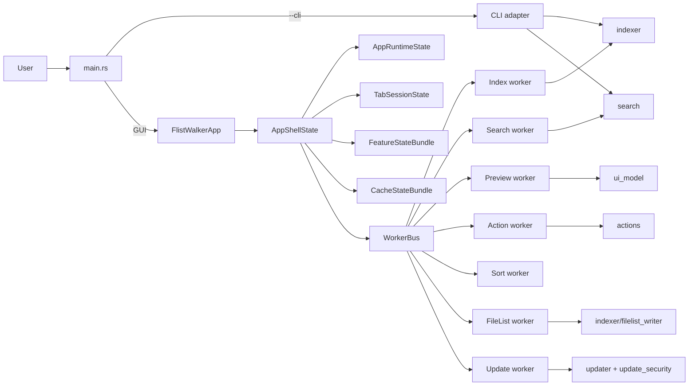
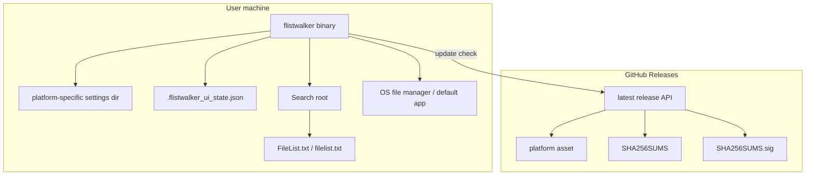

# Detailed Design Architecture Overview

## 5. Architecture Overview

FlistWalker is a single-process desktop/CLI application. The GUI path creates an eframe app and a set of background worker threads. The CLI path uses the same index and search modules synchronously.

The central design rule is that `FlistWalkerApp` remains an orchestration shell. State mutations should flow through owner modules and reducers rather than direct ad hoc field updates inside rendering code.

### Deployment View

There is no server-side component. GitHub Releases is only used for update discovery and asset download.

[[↑ Back to Top]](#top)
