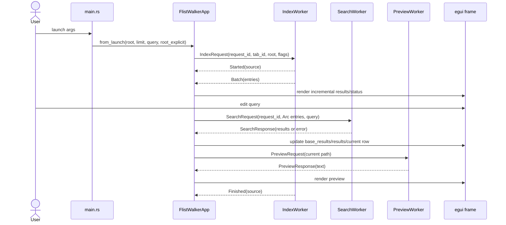
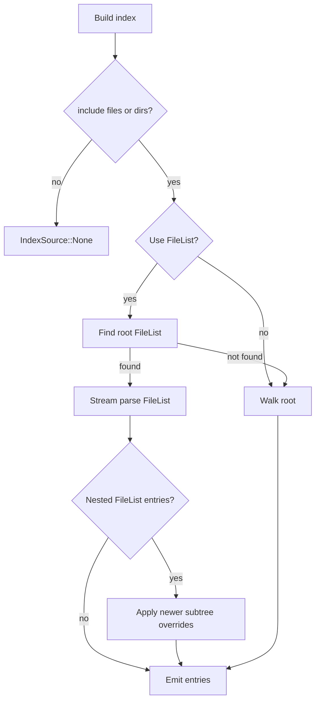
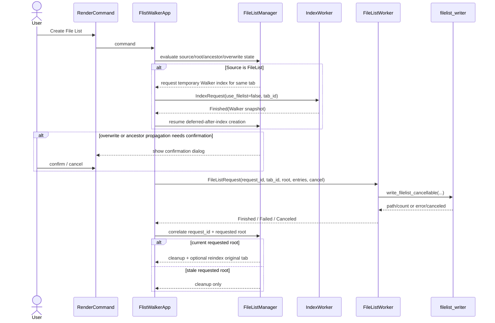
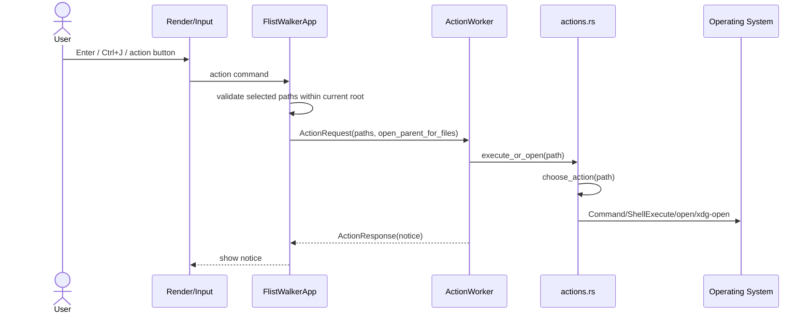
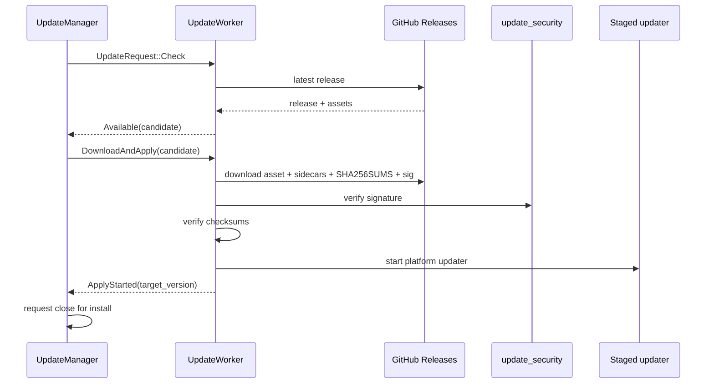

# Control Flow and Sequence

## 8. Control Flow and Sequence

### 8.1 GUI Startup, Index, Search, Preview

Key guarantees:

- Index batches can arrive while the user continues typing.
- Search request IDs prevent old responses from replacing newer query results.
- Preview runs asynchronously and can lag behind row movement without blocking it.

### 8.2 FileList Priority and Fallback

The root FileList detection is intentionally limited to the root directory. Hierarchical expansion is driven by candidate entries, not arbitrary recursive discovery.

### 8.3 Create File List

The manager boundary exists because this flow combines UI confirmations, temporary indexing, file writes, ancestor propagation, cancellation, and tab routing. The worker owns filesystem work; the app/manager owns state cleanup and follow-up dispatch.

### 8.4 Action Execution

Root containment is checked immediately before dispatch. This preserves FileList indexing speed while preventing root-external execution.

### 8.5 Self-update

If update support is manual-only, the GUI can present the release URL without launching replacement logic.

[[↑ Back to Top]](#top)
