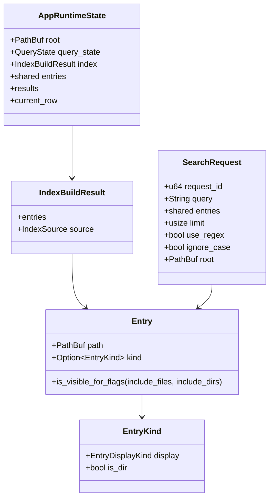

# Data Design

## 7. Data Design

### 7.1 Core Entities

### 7.2 State Lifecycle

| State | Owner | Lifecycle |
| --- | --- | --- |
| `Entry` | indexer/index worker | Created by FileList/walker; kind may be unknown initially and refined later. |
| `IndexBuildResult` | indexer / app runtime | Replaced on root/filter/source changes; source recorded as FileList/Walker/None. |
| `base_results` | result reducer | Holds search score order for returning to `Score`. |
| `results` | result reducer/render | Current display order after optional sort. |
| `AppTabState` | tab owner | Snapshot for background/persisted tabs. |
| `UiState` | session owner | JSON persisted in user home. |
| `UpdateCandidate` | updater/update manager | Created from release metadata; consumed by update prompt/install request. |
| `FileListWorkflowState` | FileList manager | Tracks confirmations, in-flight request, cancel flag, requested root, and deferred-after-index state. |
| `UpdateState` | Update manager | Tracks startup check/download request ID, prompt/failure/install-started state, skip target, and failure suppression. |
| `CacheStateBundle` | app shell | Holds bounded preview/highlight/entry-kind/sort caches and is invalidated on root/index-scope changes. |
| `RequestTabRoutingState` | tab session | Maps preview/action/sort request IDs to tab IDs until the response is consumed or the tab closes. |

### 7.3 Integrity Constraints

- `request_id` responses must only update the matching active request or mapped background tab.
- `Entry.kind == None` must not trigger synchronous metadata probing in render hot paths.
- `base_results` must remain the score-order source while `results` may be sorted.
- Query history is shared across tabs but persistence can be disabled.
- FileList creation state is correlated by both request ID and requested root.
- Update assets are trusted only after signature and checksum validation.
- Sort metadata responses are accepted only for the current sort request and mode.
- Entry kind updates use cache/epoch style side channels instead of mutating large shared entry vectors in hot paths.
- Update prompt/failure/install-started transitions must not be overwritten by stale update responses.

### 7.4 State Transition Summary

| Flow | Main states | Accepted transition | Stale/cancel handling |
| --- | --- | --- | --- |
| Indexing | `Started`, `Batch`, `ReplaceAll`, `Finished`, `Failed`, `Canceled`, `Truncated` | Matching request updates active runtime or routed background tab. | Superseded request is canceled or ignored; old batches cannot rewind the active tab. |
| Search | `SearchRequest` -> `SearchResponse` | Latest active request updates `base_results`, `results`, `current_row`, and notice/error. | Older request IDs are discarded; query edits reset sort state to `Score`. |
| FileList creation | pending confirmation -> in-flight -> finished/failed/canceled | Matching request/root may restore FileList mode and reindex the originating tab. | Stale requested root performs cleanup only; cancel releases pending/in-progress state without success follow-up. |
| Sort metadata | request -> metadata response | Matching request/mode updates sort metadata cache and display order. | Stale response is ignored and route entry is removed. |
| Preview | request -> preview response | Matching active/routed tab updates preview if path still applies. | Late responses for closed/background-mismatched tabs are discarded. |
| Update | check/download request -> prompt/failure/apply-started | Matching request updates update manager state and optional close-for-install flag. | Stale response cannot replace a newer prompt/failure/install-started state. |
| Tab session | capture/apply/switch/reorder/close | Active live state is snapshotted before tab identity changes. | Closing a tab clears request routing and pending restore refresh for that tab. |

[[↑ Back to Top]](#top)
