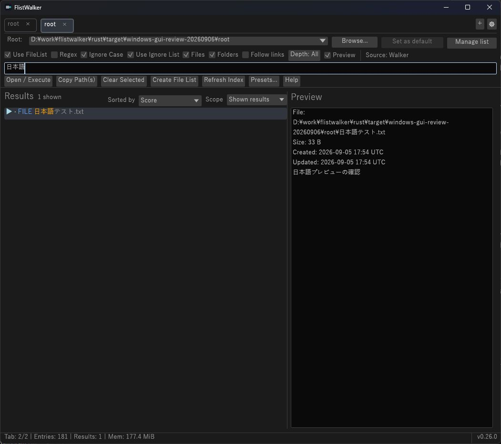
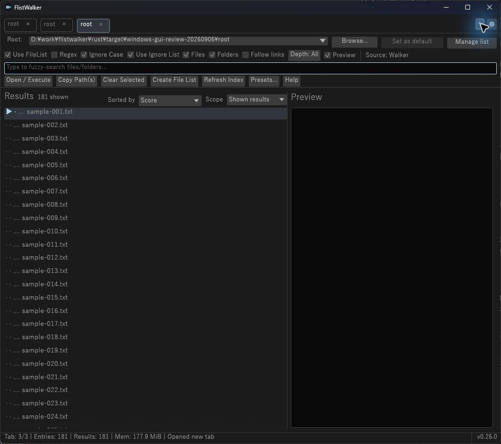
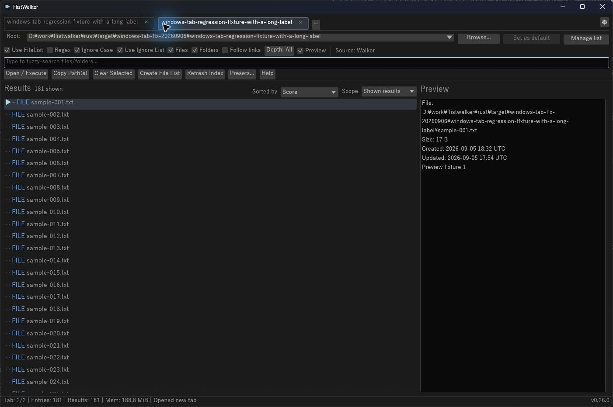
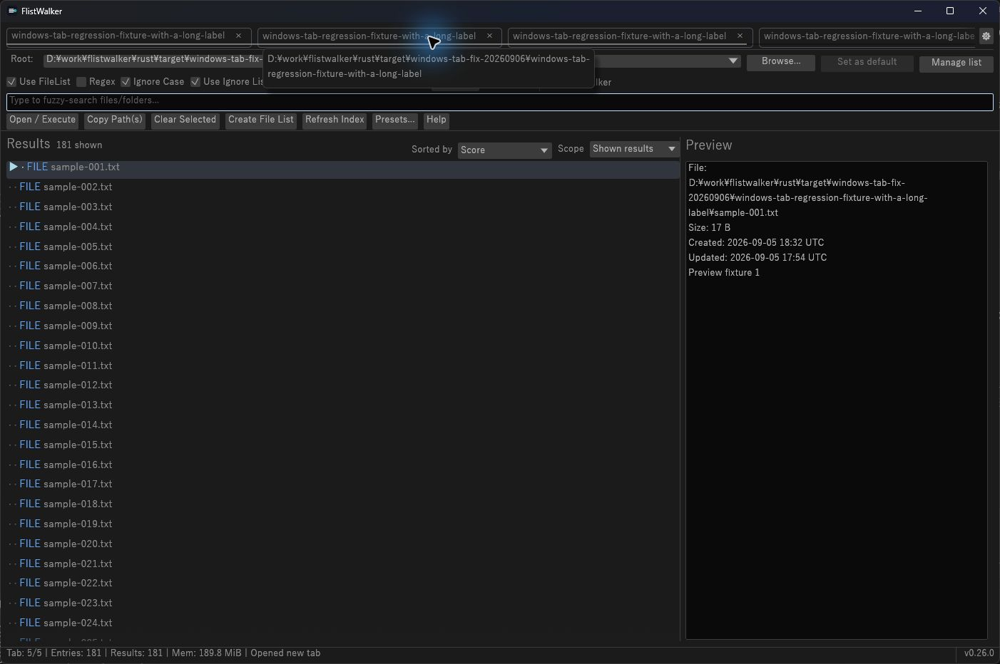
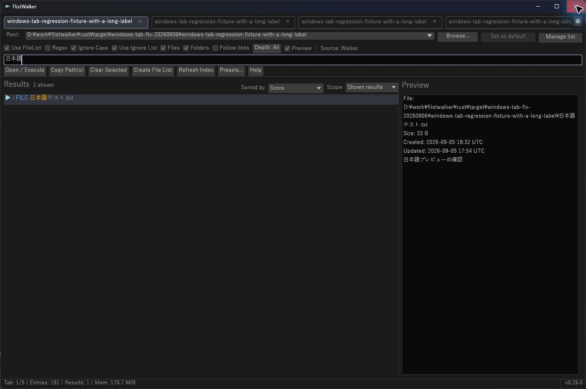

# Windows Validation — 2026-09-06

## Scope and identity

- Product: FlistWalker 0.26.0, source `cc8dcae2edcee87bcad88f5c8a5c7310194785a4`.
- Native executable: Rust 1.97.1, `x86_64-pc-windows-gnu`, release profile.
- Executable SHA-256: `C70C7BB0727E51C935F5180324B0E6DA7C70725C9A83CD229638A2BEBA7AF94E`.
- Native checks used Computer Use against an isolated staged executable, 181 generated fixture files, and isolated `LOCALAPPDATA`, `APPDATA`, `USERPROFILE`, and `HOME`. Self-update was disabled in the isolated config.
- Observed display: 2560 × 1440, scale 1.0. This is evidence for the current monitor only.
- These are scoped maintenance checks, not completion of every GSM scenario or a release approval.

## Automated validation

| Check | Result |
| --- | --- |
| Windows GNU Rust tests | PASS: 1,239 normal tests; 15 explicitly ignored library tests remain outside that count |
| FileList and Walker performance guards | PASS: 7.87x and 36.69x versus their respective control implementations |
| GNU Clippy, format, release build | PASS: Clippy/build warning-free |
| PowerShell build regression tests and dependency check | PASS |
| Release EXE resources, manifest, aliases, subsystem, DLL imports | PASS |
| Worktree tooling before interpreter repair | FAIL: 3 of 12 tests could not launch the hard-coded `python3` command |
| Worktree/tooling suite after interpreter repair | PASS: all 59 tests via `validate_change.py --base origin/master --quick` |
| Repository contract, CI guardian policy, workflow YAML | PASS: contract and guardian checks; 8 workflow files parsed |

The interpreter repair uses `sys.executable` at all six subprocess call sites in the worktree-preflight tests. Existing failing tests provide the red/green evidence; Git safety assertions are unchanged. Rust code, dependencies, and workflows were unchanged by this repair, so the preceding same-source Rust/build evidence was reused.

## Native observations

| Scoped scenario | Native result | Evidence |
| --- | --- | --- |
| Startup and listing | PASS | 181 fixture results; responsive visible window |
| Japanese literal search | PASS | Typing `日本語` produced one matching file, highlighted the matching text, and displayed Japanese preview content |
| Tab switching | PASS | The original Japanese query/result survived switching to another tab and back |
| Scrolling, mouse selection, Down key | PASS | List scrolled; selecting sample 21 and moving to sample 22 updated the current row and preview |
| Move and resize | PASS | Screenshot origin moved from (85, 78) to (325, 204); outer capture width changed from 1402 to 1051 pixels; controls remained usable |
| Geometry restoration | PASS | After normal close/relaunch, screenshot origin (325, 204) and size 1051 × 932 were identical; saved client size was 1049 × 900 |
| Session restoration | PASS | A normal launch without explicit `--root` restored two tabs, the second active tab, its Japanese query, one result, and preview |
| Ctrl+Q | PASS | The tested chord did not close the GUI; the native close button did |
| New tab initial preview | FAIL | The first row was selected and Preview enabled, but the pane remained empty until selection or query input |

Explicit `--root` suppresses saved-tab restoration by design. Geometry was checked with explicit-root relaunch; session restoration was checked separately with a normal launch.

## Open finding: new tab initial preview

Severity: P2. Status: reproduced, not repaired in the interpreter-portability change.

1. Open a populated root with Preview enabled and unlimited depth, without following links.
2. Wait for listing and the current preview to finish.
3. Add a tab using `+` and leave the query empty.
4. Observe that the first result has the current-row marker, but its preview remains empty. Query input or selecting a result starts the preview.

[`AppTabState::new_tab_from_shell`](../../rust/src/app/tab_state.rs) initializes a current row and empty preview state with `preview_reload_pending: false`. [`activate_tab_after_transition`](../../rust/src/app/tabs.rs) requests the preview only when that flag is set. The same new-tab path also displayed unresolved kind labels until subsequent interaction; that symptom needs its own regression assessment. This evidence does not establish that either symptom is Windows-exclusive.

The repair should add a focused current-row/preview-request regression and preserve asynchronous, tab-owned request handling. It is separate from the Python interpreter repair.

## Remaining native evidence

- Japanese IME conversion/composition: NOT RUN. Literal text injection is not proof of conversion-candidate handling. The available Computer Use API did not expose input-profile/mode identifier capture, restoration, and read-back required by the native residual gate. No OS input-profile setting was changed.
- Multi-display / alternate DPI: NOT RUN. Only one monitor/scale was observed; no cross-display movement or second scale was established.
- Native external Open/Reveal and real UNC: NOT RUN; outside these isolated local interaction checks.
- MSVC and WSL: NOT RUN in this Windows GNU validation session.

The staged GUI was closed after testing. Real user settings, clipboard contents, file associations, and external applications were not changed by the fixture interactions.

## Remediation addendum — 2026-09-06

The original observations above remain the pre-repair record. The GUI changes in this commit resolve the initial-preview finding and the misplaced add button. The interpreter repair is independently committed as `aaf6c72`.

- Source: `aaf6c72` plus the GUI repair in this commit; Rust 1.97.1 / Windows GNU release.
- Staged executable SHA-256: `E0E18F0EEB530071B79A34B82BA94AD68D1FAD63F55CD7821F2EFD94A5E9B1C7`.
- Fixture: fresh `rust/target/windows-tab-fix-20260906`, 181 generated files in a long-label root, isolated profile and disabled self-update. Staged app directory after execution contained only `flistwalker.exe` and the runtime-generated `flistwalker.ignore.txt.example`; no updater artifacts. The real user profile was not used.
- Changed contracts: `+` follows the last tab inside the horizontal strip; settings remains fixed. New-tab activation starts existing asynchronous kind/preview work after any default-walk reindex establishes its epoch. No filesystem work is added to rendering.

### Automated evidence

| Check | Result |
| --- | --- |
| Focused red tests before repair | FAIL as expected: add-button adjacency; empty initial preview; missing kind initialization with Preview disabled |
| Focused green tests | PASS: both new-tab regressions and all 23 `regression_gui_` tests |
| `cargo test --locked --target x86_64-pc-windows-gnu` | PASS: 1,193 library + 4 main + 45 CLI = 1,242 normal tests, zero failures; 15 library tests explicitly ignored by the ordinary suite |
| GNU Clippy all targets / fmt / release build / Windows artifact validation | PASS, zero warnings |
| VM-003 FileList / Walker ignored performance guards | PASS: 8.03x / 38.10x versus controls |
| TC-154 release transition fixture | PASS: 100,000 entries, 50 samples, p95 0.001 ms, below 50 ms hard ceiling |
| Bash and PowerShell deterministic GUI wrappers | PASS: all 12 groups; zero ignored tests executed by the wrappers |
| Canonical GUI fixture | PASS: hashes/counts; corrupt-copy rejection; existing reports preserved |
| `validate_change.py --base cc8dcae --quick`, CI guardian, workflow YAML | PASS: repository contract, 59 Python tests, guardian policy, all 8 workflows parsed |
| GUI Bash/PowerShell parsers | PASS |
| `cd rust; cargo audit` | PASS with the existing `.cargo/audit.toml` policy; its two accepted build-time quick-xml advisories are unchanged. An initial invocation from the repository root did not load that policy and reported those same two advisories. |
| Windows GNU coverage | BLOCKED by environment: `cargo llvm-cov --locked --workspace --lcov --output-path target/llvm-cov/windows-tabs-lcov.info --fail-under-lines 75` failed with E0463, missing `profiler_builtins`. No coverage percentage or threshold PASS is claimed. |

Selected routing: VM-001, VM-002, VM-006, VM-009; VM-003 was additionally applied for the kind-resolution activation intent. CI workflow/coverage policies, dependencies, index scheduling and ownership-transfer implementation were not changed. Remote PR/protection/proof-PR operations were not performed in this local repair.

Local diagnostic logs are `rust/target/windows-tabs-*.local.log`. Wrapper reports are `GUI-DETERMINISTIC-20260905T183051Z-1242.local.md` under `rust/target/gui-smoke/evidence` and `GUI-DETERMINISTIC-20260905T183235Z-30492.local.md` under `rust/target/windows-tabs-canonical/evidence`. These are transient diagnostic locators; the dated results and screenshots here are the retained evidence.

### Scoped native results

| Scenario | Deterministic | Native interaction | Liveness |
| --- | --- | --- | --- |
| GSM-001 startup/listing | PASS, full suite and wrapper | PASS, 181 results in staged app | PASS, window remained responsive during observed interactions |
| GSM-002 Japanese literal query | PASS, full suite | PASS, `日本語` returned one highlighted result | PASS during query |
| GSM-003 initial preview/kinds | PASS, regression includes bounded visible-only requests, empty/disabled preview and background response ownership | PASS, adding a second tab displayed FILE labels and selected preview without query/selection input | PASS during repeated tab creation |
| GSM-007 add/tab strip | PASS, adjacency with spare space and overflow/active visibility | PASS, `+` immediately after last tab; created five long-title tabs including adding while overflowing; settings remained fixed; manual left scroll stayed left with tab 5 active; switching to tab 1 succeeded | PASS during these interactions |
| GSM-007 session restore | PASS, session/owner regressions | PASS, normal restart restored five tabs, first active, Japanese query, one result and preview; same 1402 × 932 capture and screen origin (293, 286) | PASS after restart |
| GSM-010 scoped responsiveness | PASS, TC-154 and bounded-worker tests | PASS for these small-fixture tab/query/scroll interactions; large-root native endurance NOT RUN | PASS during observed interactions |

This is a scoped maintenance pass, not a full GSM or release sign-off. Native drag/reorder remains unconfirmed: one Computer Use drag gesture did not produce a visible reorder, so it is not recorded as PASS; deterministic drag/reorder tests passed. Actual IME composition, multi-display/alternate DPI, external Open/Reveal/clipboard, real UNC, MSVC and WSL retain the NOT RUN status above. Coverage retains the separate environment blocker. The staged process was closed after the restart check.

### Independent review and disposition

An independent read-only reviewer checked `cc8dcae..aaf6c72` plus the GUI working changes and evidence. No blocking/major findings were identified. The one minor finding requested an explicit overflow assertion that the add button is entirely within the viewport; it was applied and the focused test, full 1,242-test suite and format check passed again. The reviewed production source and staged executable were unchanged by this test-only addition. The coverage and native/platform limitations above remain unresolved validation gaps, not PASS results.
